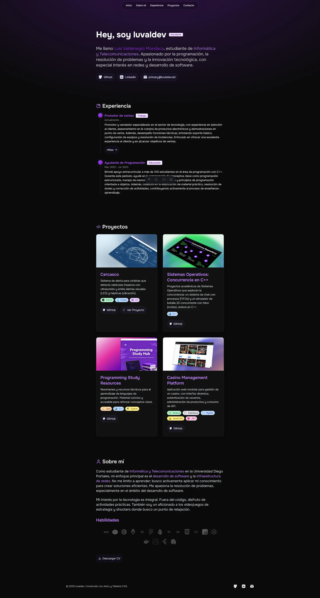

# Portafolio Personal

¡Bienvenido al repositorio de mi portafolio personal! Soy **Luis Valdenegro Mondaca**, un estudiante de Informática y Telecomunicaciones.

Este sitio web está diseñado para mostrar mis proyectos, mi experiencia profesional y mi pasión por la programación, la resolución de problemas y la innovación tecnológica, con un especial interés en redes y desarrollo de software.

---

## 📸 Vista Previa



---

## 🚀 Características Principales

El portafolio está estructurado en varias secciones clave accesibles desde la navegación principal:

- **Inicio (Hero Section):** Una breve introducción sobre quién soy y mi rol actual.
- **Sobre mí:** Un resumen de mis intereses y pasiones.
- **Experiencia:** Detalla mi experiencia laboral, incluyendo roles como Promotor de Ventas en Hites y Ayudante de Programación.
- **Proyectos:** Muestra una lista de proyectos en los que he trabajado, destacando las tecnologías utilizadas:
  - **Cercasco:** Sistema de alerta para ciclistas usando ESP32, Flutter e IoT.
  - **Programming Study Resources:** Resúmenes y recursos técnicos para el aprendizaje de programación.
  - **Casino Management Platform:** Aplicación web modular para la gestión de un casino.
- **Contacto y Redes Sociales:** Enlaces directos a mis perfiles de GitHub, LinkedIn y mi correo electrónico (primary@luvaldev.lat).
- **Footer:** Incluye derechos de autor y enlaces de navegación rápidos.

## 🛠️ Tecnologías Utilizadas

Este proyecto está construido con un stack moderno enfocado en el rendimiento y la experiencia de desarrollo:

- **Framework:** [Astro](https://astro.build/)
- **Estilos:** [Tailwind CSS](https://tailwindcss.com/)
- **Lenguaje:** TypeScript
- **Fuente:** Onest Variable

## 🏁 Cómo Empezar

Si deseas clonar y ejecutar este proyecto localmente, sigue estos pasos:

1.  **Clonar el repositorio:**

    ```bash
    git clone [https://github.com/luvaldev/portfolio-luvaldev.git](https://github.com/luvaldev/portfolio-luvaldev.git)
    ```

2.  **Navegar al directorio del proyecto:**

    ```bash
    cd portfolio-luvaldev
    ```

3.  **Instalar dependencias:**
    El proyecto usa `bun` (basado en `bun.lock`), pero también puedes usar `npm`.

    ```bash
    bun install
    # o si prefieres npm
    # npm install
    ```

4.  **Ejecutar el servidor de desarrollo:**
    Los comandos están definidos en `package.json`.

    ```bash
    bun run dev
    # o si usas npm
    # npm run dev
    ```

5.  **Abrir en el navegador:**
    Visita `http://localhost:4321` para ver el portafolio en acción.

### Comandos Útiles

- `bun run dev`: Inicia el servidor de desarrollo.
- `bun run build`: Compila el sitio para producción en el directorio `dist/`.
- `bun run preview`: Previsualiza el _build_ de producción localmente.

## 👤 Contacto

Puedes encontrarme en:

- **GitHub:** [@luvaldev](https://github.com/luvaldev)
- **LinkedIn:** [Luis Valdenegro Mondaca](https://www.linkedin.com/in/luis-valdenegrom/)
- **Correo:** [luvaldev@gmail.com](mailto:primary@luvaldev.lat)
